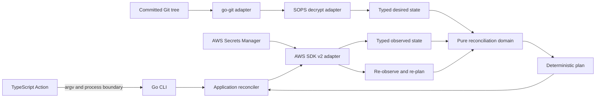

# sops-aws-sync Design

- Status: refined proposal
- Session: 001
- Date: 2026-07-20
- Scope: Go CLI and TypeScript GitHub Action

## 1. Decision summary

`sops-aws-sync` will reconcile SOPS-encrypted JSON documents in one Git commit
with an explicitly owned namespace in AWS Secrets Manager. One selected Git
file maps to one AWS secret. The committed Git tree is the desired state. AWS
Secrets Manager is the observed state.

The reconciliation engine will be pure business logic. It will accept typed
desired and observed states and return a deterministic plan. It will not import
AWS, go-git, SOPS, Cobra, Viper, logging, filesystem, or GitHub Actions APIs.

The Go CLI will own all repository discovery, SOPS decryption, AWS observation,
planning, mutation, retry handling, verification, and safe logging. The
TypeScript Action will remain a thin adapter: install a checksum- and
provenance-verified CLI, translate typed action inputs into an argument vector,
invoke the binary without a shell, and publish only non-sensitive result
metadata.

The first production release will be deliberately narrow:

- SOPS-encrypted JSON files only;
- one repository, source root, AWS account, Region, and secret-name prefix per
  invocation;
- sequential, idempotent reconciliation;
- create, update, restore, and scheduled deletion;
- no force deletion, secret rotation, replication management, or automatic
  adoption of existing secrets.

## 2. Goals

The system must:

1. read an exact committed Git tree through go-git without invoking the `git`
   executable;
2. decrypt selected blobs in process through SOPS's stable Go binding;
3. validate and canonicalize every plaintext document as JSON before any AWS
   mutation;
4. observe only the AWS secrets inside an exact ownership scope;
5. derive a deterministic, auditable reconciliation plan through pure domain
   logic;
6. reject conflicts before changing AWS;
7. apply the plan safely and idempotently;
8. re-observe and require zero executable operations and zero conflicts before
   reporting success;
9. remain responsive to cancellation and bound context-aware calls, using the
   terminal process boundary defined in Section 12 for SOPS provider calls;
10. emit useful production logs to stdout without exposing secret material by
    default;
11. provide a strict, typed CLI and Action configuration contract; and
12. conform to the repository's Moon, mise, lint, test, release, and supply
    chain standards.

## 3. Non-goals

The first release will not:

- edit, encrypt, rotate, or commit SOPS files;
- reconcile the working tree, index, or untracked files;
- support YAML, dotenv, INI, or binary plaintext;
- create AWS accounts, KMS keys, IAM roles, or GitHub OIDC providers;
- accept AWS access keys, session tokens, or plaintext secrets as CLI flags or
  Action inputs;
- manage Secrets Manager rotation configuration or replicated secrets;
- adopt, overwrite, retag, restore, or delete a same-name secret outside the
  exact ownership scope;
- provide permanent deletion or `ForceDeleteWithoutRecovery`;
- guarantee atomic multi-secret transactions or roll back completed AWS calls;
- allow arbitrary Action arguments or shell command fragments;
- execute privileged synchronization against untrusted pull request code; or
- ship a container image. The repository will use the template's binary-only
  release shape.

## 4. Verified technology baseline

These are design-time baselines. At implementation start, dependency review
selects and records the latest stable compatible versions; implementation then
pins them.

| Concern | Baseline | Decision |
|---|---|---|
| Go | repository pin `1.26.4` | Preserve the mise, lockfile, and `GOTOOLCHAIN=local` contract. |
| CLI | Cobra `v1.10.2`, Viper `v1.21.0` | Preserve constructor-based commands and an instance-local Viper. |
| Git | go-git/v5 `v5.19.1` | Use the latest stable v5 release. Do not adopt the v6 prerelease. |
| SOPS | `github.com/getsops/sops/v3` `v3.13.2` | Use only the package SOPS labels as its stable external API: `decrypt`. |
| AWS | AWS SDK for Go v2 | Pin the independently versioned `config` and `service/secretsmanager` modules. |
| AWS snapshot | core `v1.42.1`, config `v1.32.30`, Secrets Manager `v1.43.1` | Design-time evidence; pin the implementation-time selection. |
| Action template | `actions/typescript-action@57b9acc0d972b482f0db345fa09703f3612fda95` | Import this exact snapshot, record provenance, and adapt it intentionally. |
| Action runtime | Node 24 | Preserve ESM, NodeNext, ES2022, Rollup, Jest, ESLint, and Prettier. |

The imported TypeScript template is a baseline, not a permanent fork. The
repository will record the upstream commit, copied files, and deliberate
deviations in `action/UPSTREAM.md`.

## 5. System context



The dependency rule is strict:

```text
TypeScript Action -> Go CLI process
Go CLI -----------> application -> domain
adapters ---------> application ports and domain values
domain -----------> Go standard library only
```

No adapter type may cross into the domain. In particular, the domain will not
contain `*object.Commit`, AWS SDK structures, SOPS trees, Cobra commands, Viper
instances, or loggers.

## 6. Source and ownership contract

### 6.1 Git snapshot

The CLI will open the repository supplied by `--repository`, resolve
`--revision` (default `HEAD`), load its commit object, and traverse that commit's
tree. A detached `HEAD`, as used by GitHub Actions, is valid.

The working tree is never authoritative. Local modifications, untracked files,
and the Git index cannot affect desired state.

The selected source root is a repository-relative directory. The first release
will recursively select entries ending in `.sops.json`. A selected entry must
be a regular Git blob; a matching symlink, submodule, or other mode fails
desired-state construction. Directories and non-matching entries are skipped.

The Action requires `actions/checkout` to run first. A shallow checkout is
sufficient when the selected commit object and tree are present.

### 6.2 File-to-secret mapping

The mapping is deterministic and rejects ambiguity:

1. remove the configured source-root prefix;
2. remove the exact `.sops.json` suffix;
3. preserve remaining path components and case;
4. join the relative stem to the required AWS secret prefix with `/`; and
5. validate the result against Secrets Manager's name rules and length limit.

For example:

```text
source root:   secrets
secret prefix: /acme/payments
Git file:      secrets/production/database.sops.json
AWS name:      /acme/payments/production/database
```

The mapper never replaces unsupported characters. Replacement could make two
paths collide. Invalid names and duplicate mappings fail desired-state
construction before AWS mutation.

An empty desired set is rejected only when the resulting plan would schedule
one or more managed secrets for deletion. The operator must set `--allow-empty`
to authorize those new deletions. A later run in which every managed secret is
already scheduled for deletion is converged without repeating the flag.

### 6.3 Ownership boundary

A secret belongs to the configured scope only when its `managed-by` and `scope`
tags match exactly and its `source` tag is a valid SHA-256 digest:

| Tag | Meaning |
|---|---|
| `sops-aws-sync:managed-by` | Exact value `sops-aws-sync`. |
| `sops-aws-sync:scope` | Stable SHA-256 scope identifier. |
| `sops-aws-sync:source` | SHA-256 digest of the repository-relative source path. |

The scope identifier is derived from the required repository identity, source
root, AWS secret prefix, and a versioned derivation label. This prevents two
configurations from silently sharing ownership.

AWS list filters are an optimization only because tag filters are prefix
matches. The AWS adapter returns normalized reserved-tag evidence; the pure
domain classifier decides exact scope membership and desired-source identity.

For a desired name, the `source` tag must also equal the digest of that desired
path. A same-name secret outside the scope, with a missing or invalid ownership
tag, or with a different source digest is a conflict. The tool never adopts it
implicitly. Non-reserved tags on a managed secret are preserved.

## 7. Plaintext and JSON contract

The Git adapter will return encrypted blob bytes from the selected commit. The
SOPS adapter will pass those bytes to
`decrypt.DataWithFormat(..., formats.Json)`. It will not call `decrypt.File`,
which would read the working tree and violate the commit snapshot contract.

The SOPS binding verifies the document MAC before returning plaintext. The
tool accepts SOPS's supported partial-encryption policies; it does not claim
that every JSON leaf was encrypted. Repository paths, JSON keys, SOPS metadata,
and explicitly unencrypted fields remain visible in Git and are governed by
repository policy. The application will then:

- require exactly one JSON value;
- require a top-level JSON object;
- reject duplicate object keys, trailing data, invalid numbers, and invalid
  UTF-8;
- reject encrypted blobs above the configured defensive input limit and
  canonical values above Secrets Manager's 65,536-byte limit; and
- encode the value with the RFC 8785 JSON Canonicalization Scheme (JCS),
  rejecting values outside that profile.

Canonical bytes are the exact `SecretString` stored in AWS. Formatting-only
differences therefore converge once and remain stable. JCS fixes object-member
ordering, number serialization, string escaping, and Unicode handling; those
rules are versioned as part of the domain contract. The reconciler compares
canonical desired bytes with the raw current `SecretString`; it does not write
a new secret version when they are identical.

Decrypted bytes produced by this tool exist in process memory only. The tool
never writes them to disk, includes them in a report, passes them on a command
line, places them in an environment variable, or logs them. Go strings, slices,
and the AWS SDK do not permit reliable zeroization, so the implementation makes
no memory-erasure guarantee.

## 8. Domain model

The domain uses validated value types rather than interchangeable strings.
Representative types are shown only to make boundaries explicit:

```go
// SecretName is a validated AWS Secrets Manager name.
type SecretName struct {
    value string
}

// Revision identifies the exact Git commit used to build desired state.
type Revision struct {
    value string
}

// SecretValue contains canonical JSON and intentionally implements neither
// fmt.Stringer nor an encoding interface.
type SecretValue struct {
    canonicalJSON []byte
}

// DesiredSecret is one committed source document mapped to one AWS secret.
type DesiredSecret struct {
    name     SecretName
    source   SourceIdentity
    value    SecretValue
    revision Revision
}

// ObservedSlot is the complete state found at one desired or managed name.
type ObservedSlot struct {
    name        SecretName
    ownership   OwnershipEvidence
    lifecycle   Lifecycle
    payload     PayloadState
    constraints ConstraintState
    version     VersionIdentity
}
```

All validated scalar values use structs with unexported representations and
constructors; callers cannot bypass validation with a direct conversion.
`SecretValue` exposes equality and one narrowly documented byte-copy method for
the Secrets Manager adapter; it exposes no generic formatter or serializer.

`ObservedSlot` is a discriminated state, not a collection of unrelated option
values. Its closed variants distinguish missing, foreign, owned active string,
owned active binary, owned active without `AWSCURRENT`, owned scheduled for
deletion, and invalid evidence. Constraints separately represent rotation,
service ownership, replica state, and staging-label validity. `Lifecycle`,
payload, ownership, and constraints use exhaustive switches; CI rejects a new
variant without full handling.

### 8.1 Reconciliation decisions

For each identity, the pure planner returns exactly one decision:

| Desired | Observed | Decision |
|---|---|---|
| present | absent | `create` |
| present | owned, active, equal canonical value | `unchanged` |
| present | owned, active, different string, binary, or missing `AWSCURRENT` | `update` |
| present | owned, scheduled for deletion | `restore` |
| absent | owned, active | `schedule-deletion` |
| absent | owned, scheduled for deletion | `unchanged` |
| present | same name, foreign scope or source | `conflict` |
| present or absent | owned, unsupported service, rotation, replica, or staging state | `conflict` |
| any | malformed or internally inconsistent observed state | `conflict` |

A restore is intentionally a separate reconciliation cycle. Secrets Manager
does not permit reading a scheduled secret's value. The first plan restores it;
the next direct observation can then decide `update` or `unchanged`. Exactly one
follow-up apply cycle is permitted for successfully restored names. Further
restore operations or unrelated new operations indicate concurrent drift and
fail the run.

The planner returns conflicts separately from executable operations. Any
conflict prevents all mutation in that cycle. It evaluates the union of desired
names and observed scope members; it does not attempt to enumerate the
unbounded absent/absent namespace. `unchanged` is summary metadata, not an
executable operation. A plan is converged when it has zero executable
operations and zero conflicts.

### 8.2 Plan properties

Every plan is:

- deterministic for the same desired and observed states;
- sorted by operation phase and then secret name;
- free of secret values in its report representation;
- validated so one secret cannot receive contradictory operations;
- immutable after construction; and
- auditable without an AWS or Git dependency.

Every executable operation carries a typed expected-state fingerprint: absence
for create, or the observed ownership, lifecycle, constraints, staging state,
and relevant version identity for other operations. Immediately before a
mutation, the application re-observes the name and calls a pure domain
transition function. That function returns exactly one outcome:

- `apply` when the expected state still holds;
- `succeeded` when an earlier ambiguous call already produced the desired
  state;
- `retry-same-token` only while resolving one ambiguous logical write;
- `replan` when harmless drift changes the required operation;
- `conflict` when ownership or a safety constraint changed; or
- `inconclusive` when safe progress cannot be proved.

The application never improvises retry safety outside this transition model.

Operation phase order is:

1. restore;
2. create;
3. update;
4. schedule deletion.

Deletions are last so a failure cannot remove access before available creates
and updates complete.

## 9. Hexagonal package design

```text
cmd/sops-aws-sync
internal/domain
internal/application
internal/adapters/{gitrepo,sopsdecrypt,secretsmanager,logging}
internal/{cli,config}
```

These package and process boundaries are normative; filenames are not.

Package responsibilities are strict:

- `domain` owns value types, ownership classification, lifecycle and constraint
  states, decisions, precondition transitions, plan validation, and pure
  diffing.
- `application` owns use-case orchestration and the ports consumed by those use
  cases.
- `adapters/gitrepo` translates go-git commit trees into encrypted source
  documents.
- `adapters/sopsdecrypt` translates encrypted bytes into validated canonical
  `SecretValue` values.
- `adapters/secretsmanager` translates AWS SDK models and errors into normalized
  domain and application evidence.
- `cli` owns Cobra/Viper translation, command constructors, stream contracts,
  and report-file persistence.
- `cmd/sops-aws-sync` is the sole composition root. It owns signal handling,
  build metadata, process streams, dependency wiring, root command construction,
  and exit status.

Interfaces live with the application consumer, not with adapters. The domain
contains no interfaces for infrastructure and performs no I/O.

## 10. Application reconciliation lifecycle

`sync` has six durable phases:

1. Validate configuration and build the complete desired snapshot from one
   exact Git commit; any failure ends the run before AWS mutation.
2. Load the standard AWS configuration, discover all scope members currently
   returned by AWS, and directly observe every desired name.
3. Build the pure plan, emit its redacted typed report, and reject every
   conflict before mutation.
4. Apply operations sequentially with precondition checks, bounded SDK retries,
   and deadlines.
5. Re-observe desired and affected names plus the currently returned scope,
   allowing one follow-up apply cycle only for work exposed by restoration.
6. Succeed only with zero executable operations, zero conflicts, and no
   inconclusive evidence.

The desired Git snapshot never changes during a run. If the revision cannot be
resolved or any selected blob cannot be read or decrypted, no AWS write occurs.

## 11. AWS Secrets Manager adapter

### 11.1 SDK configuration

The adapter will use AWS SDK for Go v2 and `config.LoadDefaultConfig(ctx)`. It
will consume the standard configuration and credential chain, including
environment variables, web identity, shared files/profiles, container roles,
and instance roles.

The CLI accepts an optional Region and profile override. If omitted, it does
not replace the standard chain. Missing credentials or Region is an actionable
configuration error. Static credentials are never accepted by application
configuration.

### 11.2 Observation

The adapter will:

- paginate `ListSecrets` with `IncludePlannedDeletion=true`;
- use reserved tag filters only to reduce the candidate set;
- return reserved-tag evidence for pure domain classification;
- call `DescribeSecret` directly for every desired name, including names not
  returned by the filtered list;
- merge those direct results with all discovered scope members; and
- call `GetSecretValue` for `AWSCURRENT` only when the secret is active and its
  value is required for planning or verification.

This union detects a same-name foreign secret visible through either observation
path before mutation. An owned binary or missing current value is never
silently decoded; desired state produces an update to the required JSON
`SecretString`, while absent desired state produces scheduled deletion.
Authorization, transport, or undecodable-response failures remain observation
failures rather than assumed drift.

Secrets Manager operations are eventually consistent, and AWS documents that
`ListSecrets` can lag by up to five minutes. Direct `DescribeSecret` and
`GetSecretValue` provide more recent evidence for known names but cannot reveal
an unknown scope member omitted from a stale list. Success therefore means the
fully paginated observed scope plus every desired and affected name has zero
executable operations and zero conflicts. It is not a claim of a globally
strongly consistent AWS snapshot. Single-writer workflow controls are part of
that verification contract. Known stale or contradictory evidence that does
not converge before the verification deadline yields
`verification-inconclusive` and a nonzero exit.

### 11.3 Mutations

The adapter maps operations as follows:

| Domain operation | AWS call |
|---|---|
| `create` | `CreateSecret` with initial canonical `SecretString` and ownership tags. |
| `update` | `PutSecretValue` with canonical `SecretString`. |
| `restore` | `RestoreSecret`; value reconciliation occurs in the next cycle. |
| `schedule-deletion` | `DeleteSecret` with an explicit recovery window. |

`ForceDeleteWithoutRecovery` is never set and is not exposed as configuration.
The recovery window defaults to 30 days and must remain within AWS's supported
7–30 day range. Scheduling deletion makes the secret unavailable immediately;
the recovery window permits restoration before permanent deletion.

Each create or update receives a fresh, cryptographically random
`ClientRequestToken` for that logical write. The token is retained only across
the SDK's attempts and the domain-approved ambiguous-outcome recovery for that
write. A later run or a newly observed precondition creates a new token. This
prevents an old token from blocking repair when the same Git commit and value
must become `AWSCURRENT` again after external drift. Tokens are never logged.

No-op comparison prevents unnecessary versions. This is operationally
important because Secrets Manager retains versions and warns against sustained
high-frequency updates.

Non-empty `OwningService`, enabled or in-progress rotation, an unsupported
replica state, or ambiguous `AWSCURRENT` staging is a preflight conflict.
Deleting a replicated primary secret is also a conflict. Rotation, service
ownership, and replication management remain outside the first release.

### 11.4 Error and retry model

The AWS SDK standard retryer remains authoritative for retryable network,
timeout, throttling, and service failures. Configuration can adjust its bounded
maximum attempts and maximum backoff; infinite retries are invalid.

Every AWS call receives the run context plus a shorter operation deadline.
Cancellation stops further SDK attempts. The adapter classifies errors using
modeled Secrets Manager errors, `smithy.OperationError`, `smithy.APIError`, and
the AWS response request ID.

Logs contain only the operation, safe error code, fault class, request ID,
retryability, and redacted resource reference. Raw request or response bodies
and unsanitized error strings are forbidden.

A timeout or connection loss after a mutating request has an ambiguous outcome.
The application re-observes that exact name and passes the operation,
precondition, token, and new evidence to the pure transition function. It never
blindly repeats an ambiguous mutation outside the SDK's request-level retry
behavior.

Completed operations are not rolled back. On partial failure, the CLI stops
scheduling new operations, reports non-sensitive completion counts, and exits
nonzero. A later run resumes from observed state.

## 12. SOPS adapter and interruption boundary

The SOPS `decrypt` package is the only SOPS package documented as a stable API.
It does not accept `context.Context`; internally, data-key recovery uses
`context.Background()`. The CLI therefore runs one decrypt at a time in a
single-use worker and waits for either its result or cancellation. Cancellation
is terminal: the adapter returns an interruption, the composition root emits
one fixed safe event, and the process exits without waiting for the worker or
performing further application work. Process termination ends the provider
request; the design does not claim cooperative cancellation inside SOPS.

No AWS mutation begins until every decrypt succeeds. A result that races with
cancellation is discarded whenever the run context is canceled. Tests exercise
this behavior in a subprocess so an abandoned test worker cannot leak into the
test process.

The project will not copy SOPS internals merely to claim stronger cancellation.
That would abandon its only stable API. This limitation is covered in operator
documentation and revisited when SOPS exposes a context-aware stable binding.

SOPS's own loggers are global and can include provider identifiers such as a
KMS ARN. The composition root will suppress SOPS library logging by default.
The application will emit its own redacted start/success/failure events. Tests
will use sentinel provider identifiers and secret values to prove they do not
escape.

## 13. CLI contract

The command family is intentionally small:

```text
sops-aws-sync plan
sops-aws-sync sync
sops-aws-sync version
```

`plan` performs discovery and returns a redacted plan without AWS mutation.
`--detailed-exit-code` makes detected drift return exit code 2; otherwise a
valid plan returns 0.

`sync` performs the full reconciliation and verification lifecycle. It is
non-interactive and needs no confirmation flag because its state-changing name
is explicit. It returns 0 only after an empty verified plan.

`version` and `--version` report release, commit, and build date without loading
configuration or AWS.

### 13.1 Configuration

Viper uses an explicit instance. Flags are bound intentionally, environment
keys are explicit, and values are unmarshaled into a typed configuration before
dependency construction. Application code never reads Viper directly.

Precedence is:

```text
flags > SOPS_AWS_SYNC_* environment > optional config file > defaults
```

Malformed files, unknown configuration keys, invalid durations, and invalid
enum values fail before side effects.

| Key / flag | Default | Contract |
|---|---|---|
| `--config` | none | Optional YAML tool-configuration path; desired secret documents remain JSON-only. |
| `--repository` | `.` | Local repository containing the selected commit. |
| `--revision` | `HEAD` | Commit-ish resolved by go-git. |
| `--repository-id` | required | Stable ownership identity; the Action supplies `owner/repo`. |
| `--source-root` | `secrets` | Repository-relative source directory. |
| `--secret-prefix` | required | AWS name prefix and ownership boundary. |
| `--max-encrypted-bytes` | `8MiB` | Per-file defensive encrypted-input limit. |
| `--allow-empty` | `false` | Permit an empty desired set to schedule all managed secrets. |
| `--aws-region` | SDK chain | Optional standard-chain override. |
| `--aws-profile` | SDK chain | Optional shared-profile override for local use. |
| `--recovery-window-days` | `30` | Scheduled deletion recovery period, 7–30. |
| `--run-timeout` | `10m` | Whole CLI deadline; Section 12 terminates rather than cooperatively cancels an in-flight SOPS call. |
| `--operation-timeout` | `30s` | Per-AWS-call deadline. |
| `--verification-timeout` | `2m` | Known-name stabilization deadline. |
| `--aws-max-attempts` | SDK standard | Bounded total attempts per request. |
| `--aws-max-backoff` | SDK standard | Bounded retry backoff. |
| `--log-level` | `info` | `debug`, `info`, `warn`, or `error`. |
| `--log-format` | `json` | `json` or `text`; the Action always selects `json`. |
| `--show-resource-names` | `false` | Explicitly include secret names and paths in logs/reports. |
| `--report-file` | none | Write the non-sensitive machine report to a file. |

Environment names replace hyphens and dots with underscores, for example
`SOPS_AWS_SYNC_SECRET_PREFIX` and `SOPS_AWS_SYNC_OPERATION_TIMEOUT`.

AWS's own standard environment variables remain owned by the AWS SDK. Viper
does not copy credentials into the application configuration.

### 13.2 Streams and reports

The user requirement for GitHub Actions capture overrides the template's
starter stream convention:

- production operational logs go to stdout;
- Cobra usage and an emergency failure to initialize logging go to stderr;
- plaintext and encrypted secret data go nowhere;
- stable machine results go to `--report-file`, not mixed into the log stream.

The report contains schema version, tool version, Git revision, status,
operation counts, conflict count, verification result, and durations. It omits
secret values, JSON keys, ciphertext, credentials, KMS identifiers, secret
names, and source paths by default.

Exit statuses are stable compatibility surfaces:

| Code | Meaning |
|---:|---|
| 0 | Plan completed, or sync verified convergence for the observed snapshot. |
| 2 | `plan --detailed-exit-code` found executable drift. |
| 3 | Invalid input, configuration, or desired state. |
| 4 | Ownership or observed-state conflict. |
| 5 | Apply failed or ended with an unknown/partial result. |
| 6 | Verification failed or remained inconclusive. |
| 130 | Interrupted by SIGINT, SIGTERM, or parent-context cancellation. |

## 14. Logging and sensitive-data policy

The Go application uses an injected `*slog.Logger`; it never uses the global
logger. Domain functions do not log. Adapters and application services log with
the current context.

JSON logs use stable keys such as:

```text
time level msg phase operation status count duration_ms aws_error_code request_id
```

Default logs include only counts, durations, operation kinds, retry decisions,
safe AWS error codes, and request IDs. They must not include:

- decrypted or encrypted document contents;
- JSON keys or values;
- AWS credentials or GitHub tokens;
- secret version payloads;
- unsanitized SDK/SOPS errors;
- KMS ciphertext, data keys, or provider identifiers; or
- secret names and repository paths unless `--show-resource-names` is set.

Debug logging does not weaken the plaintext prohibition. The resource-name
flag changes identifier visibility only. Without it, a run-local ordinal such
as `resource-0001` correlates events; the tool never emits a stable identifier
that supports offline lookup.

## 15. TypeScript GitHub Action

### 15.1 Repository shape

Root `action.yml` keeps the consumer reference
`meigma/sops-aws-sync@<ref>`. TypeScript source, tests, package metadata,
upstream provenance, and the committed runtime bundle live under `action/`.
`action.yml` uses `node24` and `action/dist/index.js`; `.gitignore` permits only
that distribution directory. The imported template supplies filenames; only
the public paths and process boundaries in this design are normative.

### 15.2 Action boundary

The TypeScript code performs exactly five responsibilities:

1. parse Action inputs into an immutable typed configuration;
2. resolve and install one checksum- and provenance-verified CLI release;
3. construct an explicit argument array;
4. invoke the binary directly through `@actions/exec`; and
5. read the redacted report and publish safe outputs and a step summary.

It does not inspect Git, decrypt SOPS, call AWS, classify AWS errors, retry
reconciliation, diff state, or reproduce Go defaults.

The binary is invoked by absolute path with `GITHUB_WORKSPACE` as its explicit
working directory and `--repository` value. User input is never interpolated
into a shell command. The Action accepts no arbitrary `args` input.

`@actions/exec` runs with `silent: true` and `ignoreReturnCode: true` so its
default command echo and thrown exit errors cannot expose `secret-prefix`,
`source-root`, or `repository-id`. Listeners forward the CLI's JSON logs without
printing the raw executable or argument vector. The Action handles the numeric
exit status explicitly.

### 15.3 Strong typing

The imported TypeScript settings remain mandatory:

- `strict` and `strictNullChecks`;
- `noImplicitAny`;
- ESM with `NodeNext` module resolution;
- isolated modules;
- no unused locals;
- consistent filename casing; and
- typed Jest fixtures.

CI adds an explicit `tsc --noEmit` typecheck instead of relying indirectly on
Rollup. Inputs use total parsers and branded or discriminated types for paths,
exact semantic versions, durations, mode, and output status. Partial numeric
parsing, unchecked `as` assertions, `any`, and unhandled `unknown` errors are
forbidden.

`src/index.ts` is a minimal composition entrypoint. `main.ts` exports the
testable asynchronous runner. Caught values are normalized to a safe error and
always end in `core.setFailed` when execution cannot succeed.

### 15.4 Installation and version coupling

The Go CLI and Action share one immutable `vX.Y.Z` release line. The bundled
Action embeds its compatible CLI version. By default it downloads that exact
release, never `latest`.

An optional `cli-version` input accepts only an exact semantic version for
controlled compatibility testing. It does not accept branches, arbitrary URLs,
or mutable labels.

The installer will:

- map supported runner OS/architecture pairs to GoReleaser assets;
- use `@actions/tool-cache` for same-runner reuse;
- download the binary and `checksums.txt` from the same immutable release;
- verify the exact SHA-256 entry before execution;
- verify GitHub artifact provenance binds that digest to this repository and
  the expected release commit;
- re-verify the digest and provenance for every tool-cache hit; and
- fail rather than use an unverified download, source build, PATH copy of
  `sops-aws-sync`, or container.

The checksum detects corruption but is not treated as publisher authentication.
Provenance verification is mandatory because the downloaded binary executes
with the caller's AWS identity.

The verifier invokes GitHub CLI's `gh attestation verify` directly without a
shell and requires a version that supports the policy flags below. GitHub-hosted
runners satisfy this prerequisite; a self-hosted runner must install a
compatible `gh` first. For both a download and a cache hit, verification fetches
the bundle from GitHub's attestation API and requires:

- subject SHA-256 equal to the exact binary bytes;
- repository `meigma/sops-aws-sync`;
- SLSA provenance predicate;
- signer workflow `meigma/sops-aws-sync/.github/workflows/attest.yml`;
- source ref `refs/tags/vX.Y.Z`;
- source and signer digest equal to the resolved immutable release commit;
- GitHub Actions' OIDC issuer; and
- a GitHub-hosted signer runner.

The TypeScript adapter uses explicit arguments equivalent to `--repo`,
`--signer-workflow`, `--source-ref`, `--source-digest`, `--signer-digest`, and
`--deny-self-hosted-runners`, with silent execution and parsed JSON output. A
missing bundle, trust-root failure, identity mismatch, or unverifiable cache hit
is terminal.

The first release supports Linux and macOS on amd64 and arm64, matching the
template GoReleaser outputs. Windows and unsupported architectures fail early.

An optional `github-token` authenticates release and attestation API requests.
The Action masks it immediately, exposes it only to the installer and verifier,
and never forwards it to the sync CLI. Public releases can be downloaded and
verified anonymously. Private repositories require a caller token with
`contents: read` and `attestations: read` on `meigma/sops-aws-sync`.

### 15.5 Inputs and outputs

The Action's public inputs mirror only the stable CLI controls needed in CI:

| Input | Default | Mapping |
|---|---|---|
| `mode` | `plan` | Closed union `plan` or `sync`. Mutation is explicit. |
| `fail-on-drift` | `false` | In plan mode, map detected drift to Action failure when true. |
| `source-root` | `secrets` | `--source-root`. |
| `secret-prefix` | required | `--secret-prefix`. |
| `revision` | current workflow SHA | `--revision`. |
| `repository-id` | current `owner/repo` | `--repository-id`. |
| `aws-region` | standard chain | `--aws-region` only when non-empty. |
| `recovery-window-days` | CLI default | Passed only when supplied. |
| `run-timeout` | CLI default | Passed only when supplied. |
| `operation-timeout` | CLI default | Passed only when supplied. |
| `verification-timeout` | CLI default | Passed only when supplied. |
| `allow-empty` | `false` | `--allow-empty` only when true. |
| `show-resource-names` | `false` | Explicit identifier disclosure. |
| `cli-version` | embedded compatible version | Exact release override. |
| `github-token` | none | Release and attestation authentication only. |

The Action always passes a temporary `--report-file` and `--log-format=json`.
Plan mode reports drift in outputs and succeeds by default. When
`fail-on-drift=true`, it also passes `--detailed-exit-code` and maps exit 2 to a
failed Action step.
Outputs contain only:

- status;
- CLI version;
- Git revision;
- create, update, restore, scheduled-delete, unchanged, and conflict counts;
- verification status; and
- the redacted report path.

The job summary uses the same safe metadata. It does not reproduce raw CLI
stdout or expose resource names by default.

### 15.6 AWS authentication and workflow trust

The Action has no AWS credential inputs and performs no role assumption. The
caller authenticates first; GitHub-hosted workflows use AWS OIDC through
`aws-actions/configure-aws-credentials`. The Go SDK consumes the resulting
standard environment/configuration chain.

The Action itself cannot declare workflow permissions. Usage documentation
requires callers to set `contents: read`; private same-repository verification
also requires `attestations: read`. `id-token: write` is added only when the
preceding AWS authentication step uses GitHub OIDC. Cross-repository private
use passes the separately scoped `github-token` described above.

The AWS role grants `secretsmanager:ListSecrets` for discovery and limits
`DescribeSecret`, `GetSecretValue`, `CreateSecret`, `TagResource`,
`PutSecretValue`, `DeleteSecret`, and `RestoreSecret` to the configured name
prefix wherever IAM resource semantics permit. `TagResource` is required for
ownership tags on create; the tool does not issue a separate retag operation.
KMS permissions are limited to the keys required by SOPS and any
customer-managed Secrets Manager key. The tool does not require IAM,
OIDC-provider, or KMS administration permissions.

Privileged synchronization runs only after a protected default-branch merge or
through a manual protected-environment dispatch. It never runs against
untrusted `pull_request` code with AWS credentials.

Caller workflows must use a concurrency group unique to the reconciliation
scope. The system assumes one active writer per scope. The CLI still verifies
preconditions, but Secrets Manager does not provide a transaction or general
compare-and-swap primitive across secrets.

## 16. Documentation policy

Every Go package has a package comment. Every named type, function, and method
has a Godoc comment, including unexported declarations. Exported struct fields
also have comments. Comments begin with the declaration name and describe the
contract or reason, not the syntax.

This requirement is stronger than the untouched template's current effective
lint behavior. Implementation will remove conflicting lint exclusions and add a
small AST-based documentation policy check covering unexported declarations.
That check runs in the standard Moon gate.

Inline function-body comments remain sparse. Complex reconciliation rules are
documented at the domain type/function boundary and proved by tests rather than
narrated line by line.

TypeScript uses TSDoc for exported contracts and for internal functions whose
security or lifecycle behavior is not obvious. Strong names and types remain
the primary documentation inside straightforward adapters.

## 17. Test and verification strategy

### 17.1 Pure domain tests

Domain tests will cover the full desired/observed decision matrix, operation
ordering, ownership/source mismatches, rotation and service constraints,
empty-state protection, name collisions, precondition/outcome transitions,
lifecycle exhaustiveness, and deterministic plans. Fuzz tests will exercise
JCS canonicalization, path mapping, and planner invariants.

These tests use no AWS, Git, filesystem, clock, network, logger, or SOPS
dependency.

### 17.2 Go adapter and application tests

Tests will cover:

- go-git traversal of exact commits, detached HEAD, shallow repositories,
  nested blobs, symlinks, and cancellation polling;
- SOPS JSON fixtures, MAC failures, provider failures, plaintext validation,
  and log-redaction sentinels;
- AWS pagination, exact ownership checks after prefix filtering, modeled error
  classification, rotation/service constraints, ambiguous writes, fresh and
  reused idempotency tokens, restore cycles, scheduled deletions, and
  eventual-consistency handling;
- application preflight, no-write-on-conflict, partial failure, cancellation,
  bounded cycles, and verification-inconclusive results; and
- CLI flag/environment/file precedence, streams, exit codes, reports, and
  secret-free logs.

Fast tests use fakes at application ports and an HTTP-level AWS adapter test
server. A protected, opt-in sandbox AWS test proves genuine Secrets Manager
create/update/restore/scheduled-delete behavior. No real AWS credentials run in
untrusted pull request CI.

### 17.3 Action tests

The Action preserves the canonical template's Jest, coverage, lint, formatting,
Rollup, local-action, and committed-bundle checks. Tests cover:

- total input parsing and typed defaults;
- exact semantic version handling;
- OS/architecture asset mapping;
- checksum success and mismatch;
- attestation identity/digest success and mismatch;
- verified cache hit and miss;
- silent direct argv construction without a shell or argument echo;
- CLI exit propagation;
- redacted report validation;
- safe outputs, summaries, and `core.setFailed`; and
- sentinel secrets never appearing in logs.

A functional Action test invokes the real Go binary through the local Action.
The first real-AWS Action proof runs only in a protected sandbox workflow.

### 17.4 Repository gates

Moon remains the only task front door. Its root check aggregates the existing
Go and documentation gates with Action format, lint, typecheck, Jest, coverage,
bundle, and `check-dist` gates. Node 24 is pinned through mise and its lockfile.
Exact Moon and dependency-automation wiring is settled in the Action proof
slice, after the executable boundary exists.

External workflow actions remain pinned to full commit SHAs even where the
upstream TypeScript template uses mutable major tags.

## 18. Release and repository integration

Repository finalization replaces template identity throughout the executable,
release, documentation, and automation surfaces. The project uses the
template's binary-only path; container packaging is removed.

The CLI and Action share one semantic version because the Action is intentionally
coupled to the binary contract. One immutable release contains:

- Linux and macOS binaries for amd64 and arm64;
- `checksums.txt` and SBOMs;
- the committed `action/dist` bundle at the same source commit; and
- existing GitHub provenance attestations for binary artifacts.

Repository-owned workflows pin the Action to a full commit SHA. Usage
documentation requires the same for external consumers and records the
corresponding exact `vX.Y.Z` for readability and dependency automation. Exact
semantic tags are supported, but the design does not introduce a mutable `v1`
tag because protected-tag policy prohibits updates.

CODEOWNERS and protected-branch rules cover `action.yml`, `action/**`, and every
privileged workflow before the first production release.

## 19. Incremental proof order

Implementation will proceed from working evidence, not from a large speculative
build:

1. prove one committed `.sops.json` blob can be read with go-git, decrypted
   through the SOPS binding, canonicalized, and planned as one create without
   writing AWS;
2. prove create/update/no-op and direct verification against one sandbox secret;
3. add exact ownership, restore, and scheduled deletion semantics;
4. wrap the proven CLI with the imported TypeScript Action; and
5. harden CI, release integration, documentation, and real workflow evidence.

Each slice preserves the domain boundary and leaves repository checks green.
Executable evidence can refine adapter details. Moving diffing or ownership
policy out of the domain requires an explicit design revision.

## 20. Acceptance criteria

The design is implemented when all of the following are true:

- one committed `.sops.json` file maps to exactly one canonical AWS
  `SecretString`;
- Git reads use go-git only and SOPS reads use the stable in-process binding;
- the domain planner has no infrastructure dependencies and its complete state
  matrix is tested;
- same-name unowned secrets fail closed;
- create, update, restore, scheduled deletion, no-op, and conflict behavior are
  deterministic and idempotent;
- no mutation occurs after invalid desired state or a planning conflict;
- interruption, transient AWS failure, ambiguous writes, partial apply, and
  inconclusive verification produce safe nonzero results;
- a successful sync ends with zero executable operations and zero conflicts in
  the verified observed snapshot;
- default logs and reports contain no secret material or resource names;
- all Go named types/functions/methods, including unexported declarations, have
  enforced Godoc comments;
- the Action retains the pinned canonical Node 24/strict TypeScript quality
  stack and contains no reconciliation logic;
- the Action invokes a checksum- and provenance-verified exact CLI version
  without a shell or argument echo;
- AWS authentication remains caller-owned through the standard SDK chain;
- Moon runs the complete Go, Action, bundle-drift, and docs gate; and
- the repository publishes one immutable, internally compatible CLI/Action
  release line.

## 21. Primary references

- [actions/typescript-action pinned baseline](https://github.com/actions/typescript-action/tree/57b9acc0d972b482f0db345fa09703f3612fda95)
- [GitHub Action metadata syntax](https://docs.github.com/en/actions/reference/workflows-and-actions/metadata-syntax)
- [GitHub secure use reference](https://docs.github.com/en/actions/security-for-github-actions/security-guides/security-hardening-for-github-actions)
- [GitHub artifact attestations](https://docs.github.com/en/actions/concepts/security/artifact-attestations)
- [GitHub CLI attestation verification](https://cli.github.com/manual/gh_attestation_verify)
- [`@actions/exec` tool runner](https://github.com/actions/toolkit/blob/main/packages/exec/src/toolrunner.ts)
- [go-git v5.19.1](https://github.com/go-git/go-git/releases/tag/v5.19.1)
- [go-git object APIs](https://pkg.go.dev/github.com/go-git/go-git/v5/plumbing/object)
- [SOPS v3.13.2 stable decrypt API](https://github.com/getsops/sops/blob/v3.13.2/decrypt/decrypt.go)
- [SOPS data-key recovery implementation](https://github.com/getsops/sops/blob/v3.13.2/sops.go)
- [SOPS encryption protocol](https://github.com/getsops/sops/tree/v3.13.2#6-encryption-protocol)
- [RFC 8785 JSON Canonicalization Scheme](https://www.rfc-editor.org/rfc/rfc8785)
- [AWS SDK for Go v2 configuration](https://docs.aws.amazon.com/sdk-for-go/v2/developer-guide/configure-gosdk.html)
- [AWS SDK for Go v2 retries and timeouts](https://docs.aws.amazon.com/sdk-for-go/v2/developer-guide/configure-retries-timeouts.html)
- [AWS SDK for Go v2 error handling](https://docs.aws.amazon.com/sdk-for-go/v2/developer-guide/handle-errors.html)
- [AWS Secrets Manager ListSecrets](https://docs.aws.amazon.com/secretsmanager/latest/apireference/API_ListSecrets.html)
- [AWS Secrets Manager DescribeSecret](https://docs.aws.amazon.com/secretsmanager/latest/apireference/API_DescribeSecret.html)
- [AWS Secrets Manager CreateSecret](https://docs.aws.amazon.com/secretsmanager/latest/apireference/API_CreateSecret.html)
- [AWS Secrets Manager TagResource](https://docs.aws.amazon.com/secretsmanager/latest/apireference/API_TagResource.html)
- [AWS Secrets Manager PutSecretValue](https://docs.aws.amazon.com/secretsmanager/latest/apireference/API_PutSecretValue.html)
- [AWS Secrets Manager DeleteSecret](https://docs.aws.amazon.com/secretsmanager/latest/apireference/API_DeleteSecret.html)
- [AWS Secrets Manager RestoreSecret](https://docs.aws.amazon.com/secretsmanager/latest/apireference/API_RestoreSecret.html)
